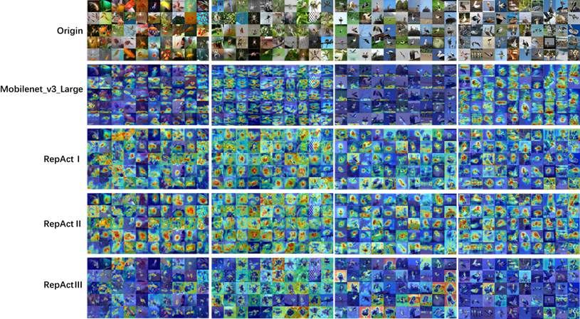

# RepAct:Re-parameter adaptive Activation Function

## Introduction


**RepAct (Re-parameter adaptive Activation function)** conducts multi-branch training on power-form activation functions such as HardSwish and ReLU, segment-wise. Through a series of experiments including image classification, object detection, and semantic segmentation, RepAct has been validated. Across various commonly used lightweight networks, RepAct shows significant improvements over original **lightweight network activation functions**. 

On **ImageNet100**, **RepAct boosts the Top-1 accuracy of MobileNetV3-Small by 7.92%**. Furthermore, in MobileNetV3, RepAct approaches the computational complexity of HardSwish during the inference stage on datasets including **Cifar100, Cifar10, VOC12-Detect, and VOC12-Segment**. It approximates or even surpasses the task accuracy achieved by various mainstream activation functions and their variants, demonstrating the effectiveness and advancement of the proposed method.

**RepAct** is designed to fully exploit the model parameter capacity while inspiring the inference and comprehension capabilities of lightweight networks. Specifically, RepAct first employs a multi-branch activation function structure to exploit different feature information using different activation branches. Secondly, to enhance the comprehension capability of different activation branches, the branches of RepAct are integrated between different layers of the neural network in a way that allows for the learning of adaptive weights.


## Start

You can test the experimental data in the Result section by downloading the corresponding Python library dependencies using [requirements.txt](requirements.txt) and then using the [TrainScript](TrainScript)  along with the reference TrainScript script format.

The [Imagenet100](https://pan.baidu.com/s/1bXr1mqjnVr9UqKBaJZmnKQ 
提取码：1234 ) dataset is a subset of the ImageNet2012-1k dataset, consisting of 100 selected categories. This subset was chosen due to resource constraints and limitations on server resources for conducting comparative experiments.

Other test result data is sourced from the following open-source projects:

- [VOC12](https://pan.baidu.com/s/1aDgVNpWdoR6Hx4wf8kb1zA 
  提取码：1234 ) This dataset can also be obtained from the official website.
- VOC12 object detection use: https://github.com/ultralytics/yolov5.git
- VOC12 semantic segmentation use: https://github.com/WZMIAOMIAO/deep-learning-for-image-processing/tree/master/pytorch_segmentation/deeplab_v3
- cifar100/cifar10 (Datasets are automatically downloaded through the project's code): https://github.com/weiaicunzai/pytorch-cifar100


## RepAct-Result

- **ImageNet100**

**Table** Comparison Table between the Original Activation Network and RepAct Series Network Top-1acc. on ImageNet100

| ImageNet100/ Top-1 acc. | Baseline | PReLu  | ACONC | RepAct-Ⅰ  | RepAct-Ⅱ  | RepAct-Ⅲ  |
| ----------------------- | -------- | ------ | ----- | --------- | --------- | --------- |
| ShuffleNetV2x0.5        | 73.0(R)  | +3.64  | +3.96 | **+5.54** | +4.04     | +4.84     |
| ShuffleNetV2x1.0        | 80.8(R)  | +0.82  | +0.78 | **+1.92** | +1.52     | +0.7      |
| MobileNetV3-Small       | 72.88(H) | + 6.88 | +6.34 | +6.9      | + 6.18    | **+7.92** |
| MobileNetV3-Large       | 79.78(H) | +3.8   | +3.22 | **+4.38** | +4.36     | **+4.38** |
| SwinTinyPatch4Window7   | 70.14(G) | /      | /     | **+9.54** | +5.98     | +8.1      |
| VitVasePatch16          | 58.92(G) | /      | /     | +3.74     | **+5.66** | -12.8     |

*(In the Baseline, "(X)" represents the activation function part of the original network, which is also replaced by RepAct. "R" represents ReLU; "H" represents HardSwish; "G" represents GELU.)*


- **Cifar100**

**Table**  Comparison Table between the Original Activation Network and RepAct Series Network **Top-1acc.** on **Cifar100**

| Cifar100/ Top-1 acc. | Baseline | PReLu | ACONC | RepAct-Ⅰ  | RepAct-Ⅱ  | RepAct-Ⅲ  |
| :------------------- | :------- | :---- | :---- | :-------- | :-------- | :-------- |
| ShuffleNetV2x0.5     | 66.71(R) | +0.72 | -0.58 | +0.04     | **+1.05** | -1.32     |
| ShuffleNetV2x1.0     | 70.82(R) | +0.36 | +0.59 | +0.43     | **+0.86** | -0.38     |
| MobileNetV3-Small    | 67.35(H) | +1.77 | +3.96 | **+5.71** | +2.32     | +3.52     |
| MobileNetV3-Large    | 70.85(H) | +2.23 | +2.25 | +3.74     | +0.37     | **+4.04** |

**Table** Comparison of **Top-1acc.** activation functions for **MobileNetV3 Small** in **Cifar100**

| Act       | Top-1 acc. | Act      | Top-1 acc. | Act    | Top-1 acc. | Act  | Top-1 acc. |
| :-------- | :--------- | :------- | :--------- | :----- | :--------- | :--- | :--------- |
| HardSwish | 67.35      | ReLU     | +1.46      | Swish  | +2.72      | ELU  | -1.83      |
| RepAct-Ⅰ  | **+5.71**  | LReLU    | +2.98      | Mish   | +2.05      | SELU | -2.37      |
| RepAct-Ⅱ  | +2.32      | PReLU    | +1.77      | FReLU  | +3.56      | GELU | +3.62      |
| RepAct-Ⅲ  | +3.52      | AReLU    | +2.00      | DYReLU | +0.94      | CELU | -1.75      |
| Identity  | -35.90     | Softplus | -14.42     | ACONC  | +3.96      | SiLU | +1.90      |


- **Cifar10**

**Table** Comparison between the original activation network and RepAct series network **Top-1acc.** on **Cifar10**

| Cifar100/ Top-1 acc. | Baseline | PReLu | ACONC | RepAct-Ⅰ  | RepAct-Ⅱ  | RepAct-Ⅲ |
| :------------------- | :------- | :---- | :---- | :-------- | :-------- | :------- |
| ShuffleNetV2x0.5     | 90.54(R) | +0.27 | -0.22 | **+0.62** | +0.39     | +0.33    |
| ShuffleNetV2x1.0     | 92.76(R) | +0.28 | -0.39 | **+0.29** | +0.15     | +0.17    |
| MobileNetV3-Small    | 91.22(H) | +0.92 | +0.26 | **+1.11** | **+1.11** | +0.92    |
| MobileNetV3-Large    | 92.68(H) | +1.56 | +1.09 | +1.31     | **+1.7**  | +1.44    |

**Table** Comparison of **Top-1acc.** activation functions for **MobileNetV3 Small** in **Cifar10**

| Act       | Top-1 acc. | Act      | Top-1 acc. | Act    | Top-1 acc. | Act  | Top-1 acc. |
| :-------- | :--------- | :------- | :--------- | :----- | :--------- | :--- | :--------- |
| HardSwish | 91.22      | ReLU     | +0.93      | Swish  | +0.74      | ELU  | -0.76      |
| RepAct-Ⅰ  | **+1.11**  | LReLU    | +1.05      | Mish   | +0.35      | SELU | -1.39      |
| RepAct-Ⅱ  | **+1.09**  | PReLU    | +0.92      | FReLU  | **+1.29**  | GELU | +0.9       |
| RepAct-Ⅲ  | +0.92      | AReLU    | +0.99      | DYReLU | +0.78      | CELU | -0.76      |
| Identity  | -31.06     | Softplus | -2.46      | ACONC  | +0.26      | SiLU | +0.13      |


- **VOC12-Detect**

**Table** Comparison experiments of YOLOV5 lightweight backbone on VOC12 dataset with mAP0.5

| BackBone/Act.     | BaseLine | RepActⅠ            | RepActⅡ        | RepActⅢ            |
| ----------------- | -------- | ------------------ | -------------- | ------------------ |
| Shufflenetv2_w0.5 | 37.37(R) | **40.56（+3.19）** | 39.64（+2.27） | 39.29（+1.92）     |
| Shufflenetv2_w1   | 48.37(R) | 49.82（+1.45）     | 49.56（+1.19） | **49.86（+1.49）** |
| MNV3-large_w0.5   | 52.75(H) | **53.56（+0.81）** | 53.51（+0.76） | 53.27（+0.52）     |
| MNV3-small_w0.5   | 45.08(H) | **46.25（+1.17）** | 46.19（+1.11） | 46.20（+1.12）     |

**Table** Comparison experiment of mAP0.5 index of YOLOV5-MNV3-small_w0.5 activation functions on VOC12s

| Act       | mAP0.5    | Act      | mAP0.5 | Act    | mAP0.5    | Act  | mAP0.5 |
| --------- | --------- | -------- | ------ | ------ | --------- | ---- | ------ |
| HardSwish | 46.07     | ReLU     | -1.04  | Swish  | -0.59     | ELU  | -2.13  |
| RepAct-Ⅰ  | +0.3      | LReLU    | -1.75  | Mish   | -0.04     | SELU | -5.70  |
| RepAct-Ⅱ  | **+1.16** | PReLU    | -0.41  | FReLU  | **+1.72** | GELU | -0.07  |
| RepAct-Ⅲ  | **+0.96** | AReLU    | -0.62  | DYReLU | -0.47     | CELU | -2.13  |
| Identity  | /         | Softplus | -1.81  | ACONC  | +0.22     | SiLU | +0.51  |


- **VOC12-Segment**

**Table** Comparative experiments of DeepLabV3-MobileNetV3-Large on the VOC12 dataset

| Act.                | Mean_IOU       | Global Acc     |
| ------------------- | -------------- | -------------- |
| BaseLine(HardSwish) | 37.9           | 81.4           |
| RepActⅠ             | 40.0(+2.1)     | 84.0(+2.6)     |
| RepActⅡ             | 40.1(+2.2)     | 83.3(+1.9)     |
| RepActⅢ             | **42.5(+4.6)** | **84.8(+3.4)** |
| ReLU                | 36.8(-1.1)     | 82.4(+1.0)     |
| LReLU               | 35.2(-2.7)     | 82.2(+0.8)     |
| PReLU               | 40.7(+2.8)     | 84.2(+2.8)     |
| FReLU               | 29.4(-8.5)     | 76.5(-4.9)     |
| DYReLU              | 37.5(-0.4)     | 82.8(+1.4)     |
| AReLU               | 40.8(+2.9)     | 84.3(+2.9)     |
| SiLU                | 39.1(+1.2)     | 83.5(+2.1)     |
| Softplus            | 36.0(-1.9)     | 78.1(-3.3)     |
| Swish               | 39.6(+1.7)     | 84(+2.6)       |
| Mish                | 38.9(+1.0)     | 83.1(+1.7)     |
| ELU                 | 38.0(+0.1)     | 82(+0.6)       |
| SELU                | 32.2(-5.7)     | 79.3(-2.1)     |
| GELU                | 38.0(+0.1)     | 83.3(+1.9)     |
| CELU                | 38.0(+0.1)     | 82.3(+0.9)     |
| ACONC               | 38.8(+0.9)     | 83.6(+2.2)     |


## RepAct-Visualization

- **GradCAM Visualization Compare**

|  |  |
| :----------------------------------------------------------: | :----------------------------------------------------------: |
|           MobileNetV3-Large-First-Feature GradCAM            |            MobileNetV3-Large-Last-Feature GradCAM            |

After the network training is completed, you can modify and use the folders  [tools](tools) /  [grad_cam](tools/grad_cam)  /  [main_cnn.py](tools/grad_cam/main_cnn.py) under the project engineering to implement the GradCAM Visualization Compare.


- **Heatmap Compare Figure**


RepAct I and HardSwish in MobileNetV3-Large, after training in ImageNet100, are visualized as heatmaps of feature maps before and after passing through the final convolutional layer

You can use the folders [tools](tools) / [drawFmapHeatMap](tools/drawFmapHeatMap) / [heatMap.py](tools/drawFmapHeatMap/heatMap.py)  under the project engineering to perform heat map validation testing.(add HeatMapfunc. into model)


- **RepAct and Its Work on Gradient**

Visualizing the Three-dimensional Representation of Activation Function Branch Combination Selection in MobileNetV3-Large-RepActⅠ During ImageNet100 Training, Alongside Corresponding Convolutional and Batch Normalization Gradient Profiles.

|  |
| ------------------------------------------------------------ |
| (a) Visualization of the Curve of Absolute Mean Gradient Magnitudes in Early Layers during Training, Alongside the Training Visualization of RepActⅠ. |
|  |
| (b) Visualization of the Curve of Absolute Mean Gradient Magnitudes in Deep Layers during Training, Alongside the Training Visualization of RepAct-Ⅰ. |

You can utilize the plot_repact_layers function in the [train.py](train.py)  file within your project's engineering folder to plot different 3D visualizations. Additionally, after training completion, you can use [tools](tools) / [drawAct3D](tools/drawAct3D) / [ReadPathDraw3D.py](tools/drawAct3D/ReadPathDraw3D.py) to draw these visualizations. Furthermore, you can combine this with TensorBoard's gradient visualization tool to display RepAct and its effects on gradients. Integrating TensorBoard's gradient visualization tool can be easily added to the code as needed.


## Valid RepAct's Re-parameter

- **Accuracy Validation**

To perform a simple validation of the accuracy issue related to single-layer RepAct, you can use [RepActs](RepActs) / [validRep](RepActs/validRep) / [RepAct_xxx_Reconstruct.py](RepActs/validRep/RepAct_xxx_Reconstruct.py) .

After training with the RepAct_xxx_Reconstruct activation function from [RepAct_xxx_Reconstruct.py](RepActs/validRep/RepAct_xxx_Reconstruct.py), you can use [val.py](val.py) to conduct a simple validation of the accuracy issue related to the entire network's RepAct.

- **Speed Validation**

Unfortunately, due to limited familiarity with CUDA on a personal level, we only performed a simple validation of the correctness of RepAct's re-parameterization calculations. We were unable to provide an appropriate CUDA operator since the activation function was initially designed with custom IP operators for use on ZYNQ.


## Easily Use RepAct in Your Network

You can easily replace the activation functions in other networks with the ./RepActs/RepActs.py file for relevant experiments. However, it's essential to note that when declaring RepAct, each layer should have its independent RepAct instance rather than reusing a single RepAct instance across different layers, as unexpected effects may occur.

Alternatively, you can utilize [RepActs.py](RepActs/RepActs.py) under the [RepActs](RepActs) directory along with [actFactory.py](model/actFactory.py)  and  [actFactory.py](model/actFactory.py) under the [model](model) directory. Simply call Activation Factory to generate activation function instances for each layer.


## Thanks

Acknowledgments to numerous open-source programs for their assistance and inspiration🔥:

https://github.com/weiaicunzai/pytorch-cifar100

https://github.com/ultralytics/yolov5.git

https://github.com/WZMIAOMIAO/deep-learning-for-image-processing/tree/master/pytorch_segmentation/deeplab_v3

https://github.com/DingXiaoH/RepVGG

...


## Contact

Thou@stu.scu.edu.cn

Citation:

```
coming soon
```

